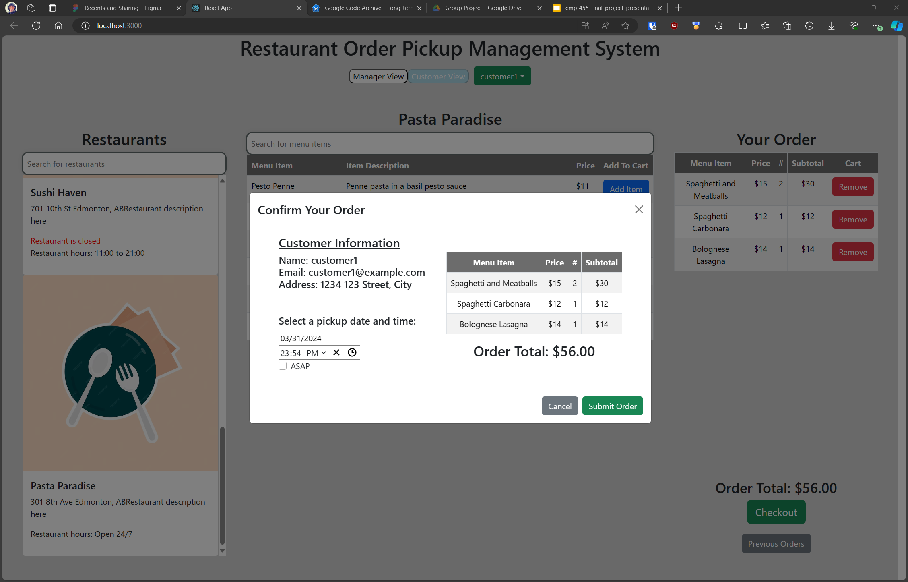
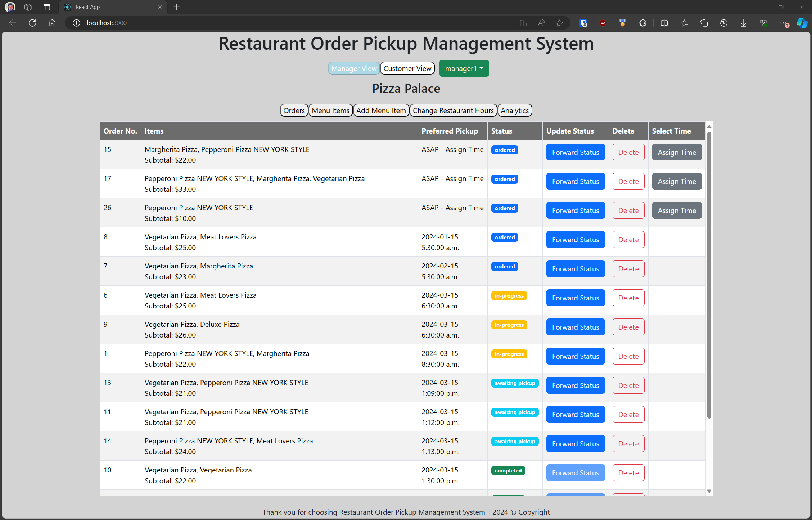

# Table of Contents
1. [Project Description](#project-description)
2. [Technologies Used](#technologies-used)
3. [Project Structure](#project-structure)
4. [Installation](#installation)
5. [Usage](#usage)
6. [Getting Started with Create React App](#getting-started-with-create-react-app)

# Project Description

This project is a simple React application that mimics a simple Restaurant Ordering and Pickup Management System. There are two main components to the web application:

1. Customer component - This component allows customers to select a restaurant, view the menu, add items to their cart, and place an order. The customer can also view their order history and the status of their current order.
2. Restaurant Manager component - This component allows restaurant managers to view all orders placed at their restaurant, update the status of orders, and view the order history of their restaurant. They can also add, remove, and edit menu items, and view statistics about their restaurant.

# Technologies Used
The following technologies were used in the project:

Frontend:
- React
- React Bootstrap
- Axios

Backend:
- Node.js
- Express
- Mongoose

Database:
- MongoDB


# Project Structure
The backend and frontend are separate directories in the project, each with their own package dependencies and scripts. The backend directory contains the Node.js server that serves the API and the frontend directory contains the React application that consumes the API.

The the main project directories and files are as follows:
```
├── backend/
│   ├── controllers/
│   ├── database/
│   │   ├──database.js
│   ├── models/
│   │   ├──customer.model.js
│   │   ├──manager.model.js
│   │   ├──menuItem.model.js
│   │   ├──order.model.js
│   │   ├──restaurant.model.js
│   ├── repositories/
│   ├── routes/
│   ├── index.js
│   ├── package.json
├── frontend/
│   ├── public/
│   ├── src/
│   │   ├── components/
│   │   ├── App.js
│   │   ├── App.css
│   │   ├── index.js
│   ├── package.json
├── .gitignore
├── README.md
```

In the backend, the controllers, models, repositories, and routes directories each contain a file for each of the main components in the project (Customer, Manager, MenuItem, Order, and Restaurant).

In the frontend, there are too many components to list here, but the main components are Restaurant Cards, Menu Item tables, a Dropdown, a search bar, and several other things like popup windows.

# Installation
To run the project, you will need to install the dependencies for both the frontend and backend and start the servers for both components. The following steps will guide you through the installation process:

1. Clone the repository
```
git clone
```

2. Install the dependencies for the backend
```
cd backend
npm install
```

3. Install the dependencies for the frontend
```
cd frontend
npm install
```

4. Start the MongoDB server
```
mongod
```

5. Start the backend server
```
cd backend
npm start
```

6. Start the frontend server
```
cd frontend
npm start
```

7. Open your browser and navigate to http://localhost:3000 to view the application.

# Usage

Customer View: Select a customer, select a restaurant, add items to your cart, and place an order. View your order history and the status of your current order.


<br/>
<br/>

Manager View: Select a manager, view all orders placed at the restaurant, update the status of orders, view order history, add, remove, and edit menu items, and view statistics about the restaurant.


<br/>

# Test Case

The repo has a supplied test data set in the /jsonData directory. The data is stored in several JSON files, each representing a different collection in the database. The data can be imported into the database using the following steps:

1. Start the MongoDB server
```
mongod
```

2. Start the backend server
```
cd backend
npm start
```

3. Open your browser and navigate to http://localhost:8080/preload (alternatively, you can use a program like postman to run the request). >>> NOTE: THIS WILL DELETE ALL EXISTING DATA IN THE DATABASE PRIOR TO IMPORTING THE TEST DATA <<<

# Getting Started with Create React App

This project was bootstrapped with [Create React App](https://github.com/facebook/create-react-app).

## Available Scripts

In the project directory, you can run:

### `npm start`

Runs the app in the development mode.\
Open [http://localhost:3000](http://localhost:3000) to view it in your browser.

The page will reload when you make changes.\
You may also see any lint errors in the console.

### `npm test`

Launches the test runner in the interactive watch mode.\
See the section about [running tests](https://facebook.github.io/create-react-app/docs/running-tests) for more information.

### `npm run build`

Builds the app for production to the `build` folder.\
It correctly bundles React in production mode and optimizes the build for the best performance.

The build is minified and the filenames include the hashes.\
Your app is ready to be deployed!

See the section about [deployment](https://facebook.github.io/create-react-app/docs/deployment) for more information.

### `npm run eject`

**Note: this is a one-way operation. Once you `eject`, you can't go back!**

If you aren't satisfied with the build tool and configuration choices, you can `eject` at any time. This command will remove the single build dependency from your project.

Instead, it will copy all the configuration files and the transitive dependencies (webpack, Babel, ESLint, etc) right into your project so you have full control over them. All of the commands except `eject` will still work, but they will point to the copied scripts so you can tweak them. At this point you're on your own.

You don't have to ever use `eject`. The curated feature set is suitable for small and middle deployments, and you shouldn't feel obligated to use this feature. However we understand that this tool wouldn't be useful if you couldn't customize it when you are ready for it.

## Learn More

You can learn more in the [Create React App documentation](https://facebook.github.io/create-react-app/docs/getting-started).

To learn React, check out the [React documentation](https://reactjs.org/).

### Code Splitting

This section has moved here: [https://facebook.github.io/create-react-app/docs/code-splitting](https://facebook.github.io/create-react-app/docs/code-splitting)

### Analyzing the Bundle Size

This section has moved here: [https://facebook.github.io/create-react-app/docs/analyzing-the-bundle-size](https://facebook.github.io/create-react-app/docs/analyzing-the-bundle-size)

### Making a Progressive Web App

This section has moved here: [https://facebook.github.io/create-react-app/docs/making-a-progressive-web-app](https://facebook.github.io/create-react-app/docs/making-a-progressive-web-app)

### Advanced Configuration

This section has moved here: [https://facebook.github.io/create-react-app/docs/advanced-configuration](https://facebook.github.io/create-react-app/docs/advanced-configuration)

### Deployment

This section has moved here: [https://facebook.github.io/create-react-app/docs/deployment](https://facebook.github.io/create-react-app/docs/deployment)

### `npm run build` fails to minify

This section has moved here: [https://facebook.github.io/create-react-app/docs/troubleshooting#npm-run-build-fails-to-minify](https://facebook.github.io/create-react-app/docs/troubleshooting#npm-run-build-fails-to-minify)
